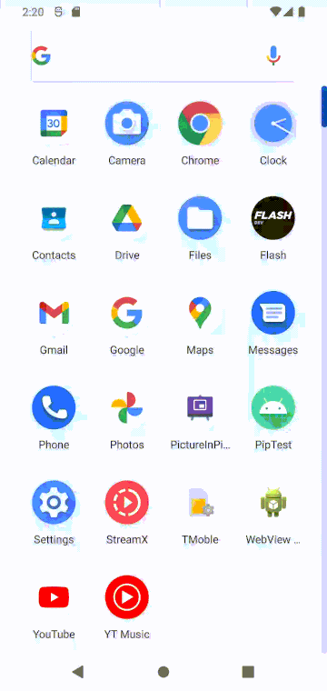

Steps to reproduce:
1. Open video activity
2. Press home to start PiP
3. Open video again via PiP fullscreen button
4. Press back to return to first activity
5. Try to open video activity again

This also happens in logcat:
```
2021-08-30 02:21:02.958 543-2752/system_process I/ActivityTaskManager: START u0 {cmp=com.dtlim.piptest/.VideoActivity} from uid 10151
2021-08-30 02:21:02.958 543-2752/system_process W/ActivityTaskManager: Background activity start [callingPackage: com.dtlim.piptest; callingUid: 10151; appSwitchAllowed: false; isCallingUidForeground: true; callingUidHasAnyVisibleWindow: true; callingUidProcState: TOP; isCallingUidPersistentSystemProcess: false; realCallingUid: 10151; isRealCallingUidForeground: true; realCallingUidHasAnyVisibleWindow: true; realCallingUidProcState: TOP; isRealCallingUidPersistentSystemProcess: false; originatingPendingIntent: null; allowBackgroundActivityStart: false; intent: Intent { cmp=com.dtlim.piptest/.VideoActivity }; callerApp: ProcessRecord{efb6bc8 10701:com.dtlim.piptest/u0a151}; inVisibleTask: true]
```

For some reason it's trying to start the activity in the background, even though we are already at the activity.
Another strange thing is it also sometimes opens, but after a very long delay.

